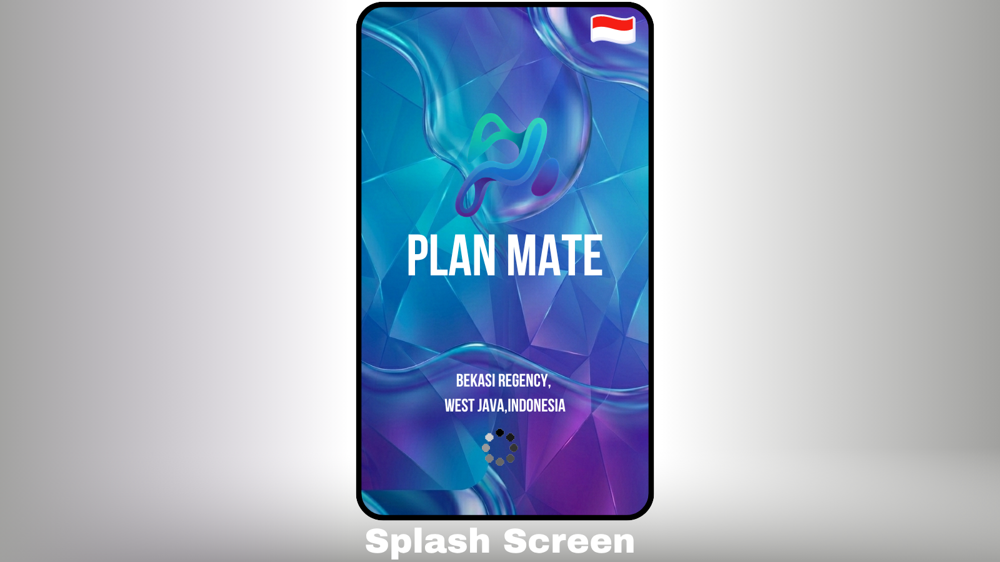
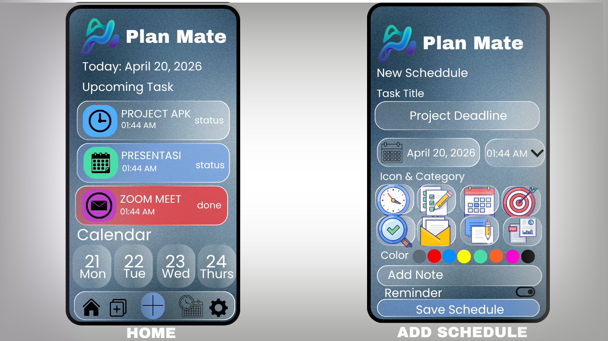
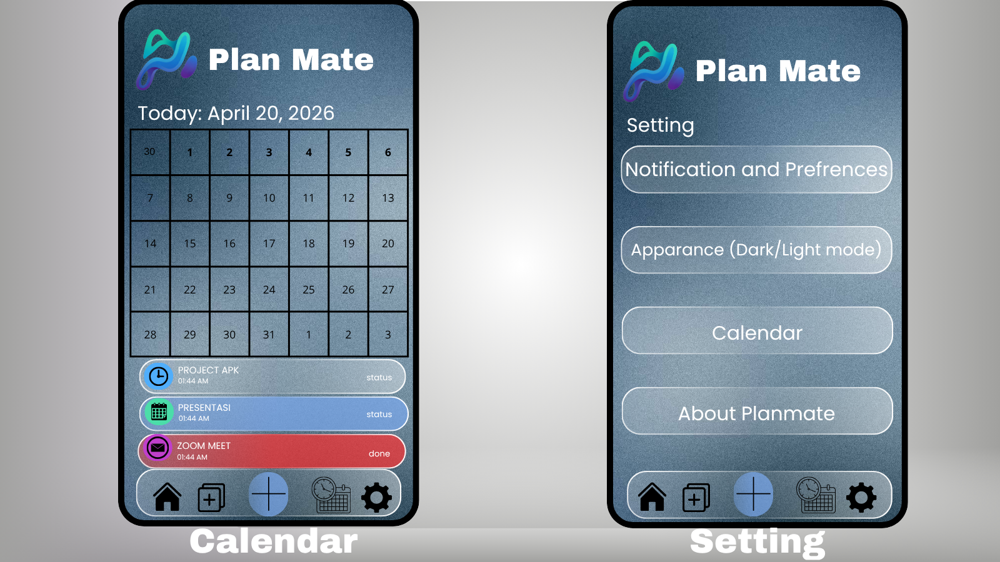
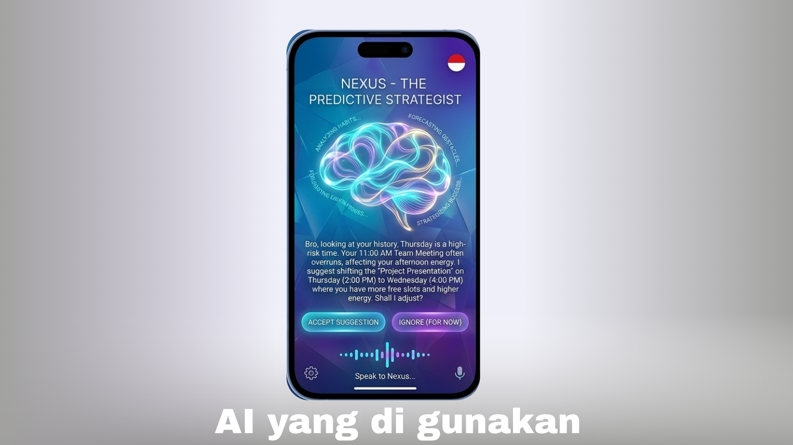

# 📅 Plan Mate - Productivity Redefined

  
   

  
  
  
  

---

## 📌 Tentang Plan Mate
**Plan Mate** adalah instrumen manajemen waktu komprehensif yang dirancang untuk mengoptimalkan produktivitas harian pengguna. Dengan memadukan antarmuka minimalis dan teknologi kecerdasan buatan proaktif, aplikasi ini memastikan setiap agenda, tenggat waktu, dan rutinitas dapat dieksekusi secara presisi dan terstruktur.

---

## 🧠 Integrasi AI Nexus & Fitur Utama

Plan Mate tidak sekadar mencatat jadwal, melainkan bertindak sebagai asisten virtual yang ditenagai oleh **AI Nexus**. Algoritma ini dirancang untuk memahami pola kerja pengguna dan memberikan efisiensi maksimal melalui fitur-fitur berikut:

1. **AI Nexus - Predictive Scheduling:** Saat pengguna memasukkan jadwal baru, AI Nexus akan memprediksi dan merekomendasikan estimasi durasi serta slot waktu terbaik berdasarkan rekam jejak penyelesaian tugas sebelumnya.
2. **AI Nexus - Smart Auto-Categorization:** Mesin AI secara otomatis mengenali konteks input teks (misalnya: "Kerjakan laporan Bisnis Elektronik") dan mengelompokkannya ke dalam kategori yang tepat (Tugas Akademik, Pribadi, atau Pekerjaan).
3. **Dynamic Dashboard:** Pusat kontrol dengan antarmuka dinamis yang menampilkan *Progress Bar* produktivitas harian secara *real-time*, disesuaikan dengan metrik penyelesaian tugas.
4. **Contextual Splash Screen:** Sambutan personal yang beradaptasi dengan waktu lokal pengguna (Pagi/Siang/Malam) dan menampilkan identitas regional (Bekasi) untuk pendekatan antarmuka yang lebih humanis.
5. **Intelligent Push-Reminder:** Sistem notifikasi cerdas yang memungkinkan tindakan langsung (seperti "Tandai Selesai" atau "Tunda Sementara") langsung dari layar kunci tanpa harus membuka aplikasi.

---

## 🛠️ Lingkungan Pengembangan (Tech Stack)
Pengembangan aplikasi ini mengimplementasikan adaptasi lingkungan kerja baru menggunakan sistem operasi distribusi Linux untuk efisiensi kompilasi.

* **Sistem Operasi:** Pop!_OS (Linux)
* **Framework & Bahasa:** Flutter / Dart
* **Code Editor & Compiler:** Visual Studio Code & Android Studio (SDK & Toolchain Provider)
* **Desain Antarmuka:** Canva & Storyboarding
* **Manajemen Proyek:** ClickUp (Task Tracking & Sinkronisasi Alur Kerja)

---

## 📸 Dokumentasi Antarmuka 
| Splash Screen | Smart Dashboard | Tambah Jadwal (AI) | Intelligent Reminder |
|:---:|:---:|:---:|:---:|
|  |  |  |  |

---

## 👤 Identitas Pengembang
* **Nama:** Dedi Ramadhan
* **Kelas:** I241B
* **NIM:** 312410171
* **Mata Kuliah:** Pemrograman Mobile 2
* **Dosen Pengampu:** Donny Maulana, S.Kom., M.M.S.I.

---

## ✉️ Catatan Klarifikasi (Yth. Bapak Donny Maulana, S.Kom., M.M.S.I.)

> Melalui catatan ini, saya memohon maaf sekaligus memberikan klarifikasi terkait riwayat repositori (*commit log*) serta perubahan lingkungan pengembangan pada proyek Plan Mate.
>
> Menjelang batas waktu pengumpulan tugas, perangkat komputer utama saya mengalami kendala teknis fatal yang mengakibatkan hilangnya *source code* awal proyek ini. Situasi *force majeure* ini memaksa saya untuk melakukan migrasi mendadak ke perangkat cadangan dan beradaptasi penuh menggunakan sistem operasi **Linux Pop!_OS**. 
>
> Proses adaptasi terhadap ekosistem Linux—mulai dari konfigurasi ulang dependensi Flutter, pengaturan *Android toolchain*, hingga penyesuaian alur kerja di *terminal*—membutuhkan waktu pembelajaran tersendiri. Berbekal *backup* kerangka desain (Canva/Wireframe) yang berhasil diselamatkan dan diskusi teknis dengan rekan sebaya, saya mengupayakan pemulihan proyek ini dari awal.
>
> Oleh karena itu, seluruh log pengerjaan (*commit*) di Android Studio/VS Code maupun riwayat tugas di **ClickUp** tercatat dalam rentang waktu yang sangat padat (hari ini) pasca-migrasi sistem. Saya berharap Bapak dapat memaklumi kondisi teknis ini sebagai bentuk dedikasi dan tanggung jawab saya untuk tetap menyerahkan hasil terbaik sesuai tenggat waktu yang ditentukan.
>
> Terima kasih atas perhatian dan kebijaksanaan Bapak.

---

  <b>Plan Mate Project © 2026 | Dibuat dengan Flutter</b>

# 📅 Plan Mate - Productivity Redefined

  
   

  
  
  
  

---

## 📌 Tentang Plan Mate
**Plan Mate** adalah instrumen manajemen waktu komprehensif yang dirancang untuk mengoptimalkan produktivitas harian pengguna. Dengan memadukan antarmuka minimalis dan teknologi kecerdasan buatan proaktif, aplikasi ini memastikan setiap agenda, tenggat waktu, dan rutinitas dapat dieksekusi secara presisi dan terstruktur.

---

## 🧠 Integrasi AI Nexus & Fitur Utama

Plan Mate tidak sekadar mencatat jadwal, melainkan bertindak sebagai asisten virtual yang ditenagai oleh **AI Nexus**. Algoritma ini dirancang untuk memahami pola kerja pengguna dan memberikan efisiensi maksimal melalui fitur-fitur berikut:

1. **AI Nexus - Predictive Scheduling:** Saat pengguna memasukkan jadwal baru, AI Nexus akan memprediksi dan merekomendasikan estimasi durasi serta slot waktu terbaik berdasarkan rekam jejak penyelesaian tugas sebelumnya.
2. **AI Nexus - Smart Auto-Categorization:** Mesin AI secara otomatis mengenali konteks input teks (misalnya: "Kerjakan laporan Bisnis Elektronik") dan mengelompokkannya ke dalam kategori yang tepat (Tugas Akademik, Pribadi, atau Pekerjaan).
3. **Dynamic Dashboard:** Pusat kontrol dengan antarmuka dinamis yang menampilkan *Progress Bar* produktivitas harian secara *real-time*, disesuaikan dengan metrik penyelesaian tugas.
4. **Contextual Splash Screen:** Sambutan personal yang beradaptasi dengan waktu lokal pengguna (Pagi/Siang/Malam) dan menampilkan identitas regional (Bekasi) untuk pendekatan antarmuka yang lebih humanis.
5. **Intelligent Push-Reminder:** Sistem notifikasi cerdas yang memungkinkan tindakan langsung (seperti "Tandai Selesai" atau "Tunda Sementara") langsung dari layar kunci tanpa harus membuka aplikasi.

---

## 🛠️ Lingkungan Pengembangan (Tech Stack)
Pengembangan aplikasi ini mengimplementasikan adaptasi lingkungan kerja baru menggunakan sistem operasi distribusi Linux untuk efisiensi kompilasi.

* **Sistem Operasi:** Pop!_OS (Linux)
* **Framework & Bahasa:** Flutter / Dart
* **Code Editor & Compiler:** Visual Studio Code & Android Studio (SDK & Toolchain Provider)
* **Desain Antarmuka:** Canva & Storyboarding
* **Manajemen Proyek:** ClickUp (Task Tracking & Sinkronisasi Alur Kerja)

---

## 📸 Dokumentasi Antarmuka 
| Splash Screen | Smart Dashboard | Tambah Jadwal (AI) | Intelligent Reminder |
|:---:|:---:|:---:|:---:|
|  |  |  |  |

---

## 👤 Identitas Pengembang
* **Nama:** Dedi Ramadhan
* **Kelas:** I241B
* **NIM:** 312410171
* **Mata Kuliah:** Pemrograman Mobile 2
* **Dosen Pengampu:** Donny Maulana, S.Kom., M.M.S.I.

---

## ✉️ Catatan Klarifikasi (Yth. Bapak Donny Maulana, S.Kom., M.M.S.I.)

> Melalui catatan ini, saya memohon maaf sekaligus memberikan klarifikasi terkait riwayat repositori (*commit log*) serta perubahan lingkungan pengembangan pada proyek Plan Mate.
>
> Menjelang batas waktu pengumpulan tugas, perangkat komputer utama saya mengalami kendala teknis fatal yang mengakibatkan hilangnya *source code* awal proyek ini. Situasi *force majeure* ini memaksa saya untuk melakukan migrasi mendadak ke perangkat cadangan dan beradaptasi penuh menggunakan sistem operasi **Linux Pop!_OS**. 
>
> Proses adaptasi terhadap ekosistem Linux—mulai dari konfigurasi ulang dependensi Flutter, pengaturan *Android toolchain*, hingga penyesuaian alur kerja di *terminal*—membutuhkan waktu pembelajaran tersendiri. Berbekal *backup* kerangka desain (Canva/Wireframe) yang berhasil diselamatkan dan diskusi teknis dengan rekan sebaya, saya mengupayakan pemulihan proyek ini dari awal.
>
> Oleh karena itu, seluruh log pengerjaan (*commit*) di Android Studio/VS Code maupun riwayat tugas di **ClickUp** tercatat dalam rentang waktu yang sangat padat (hari ini) pasca-migrasi sistem. Saya berharap Bapak dapat memaklumi kondisi teknis ini sebagai bentuk dedikasi dan tanggung jawab saya untuk tetap menyerahkan hasil terbaik sesuai tenggat waktu yang ditentukan.
>
> Terima kasih atas perhatian dan kebijaksanaan Bapak.

---

  <b>Plan Mate Project © 2026 | Dibuat dengan Flutter</b>

